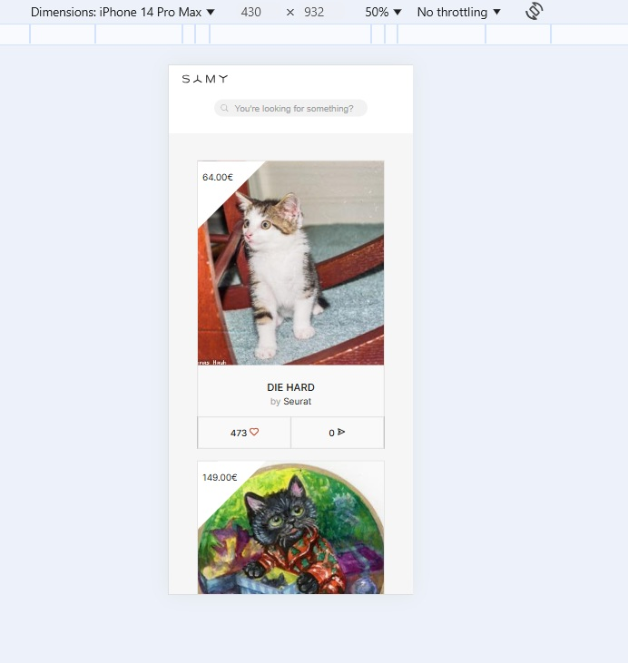
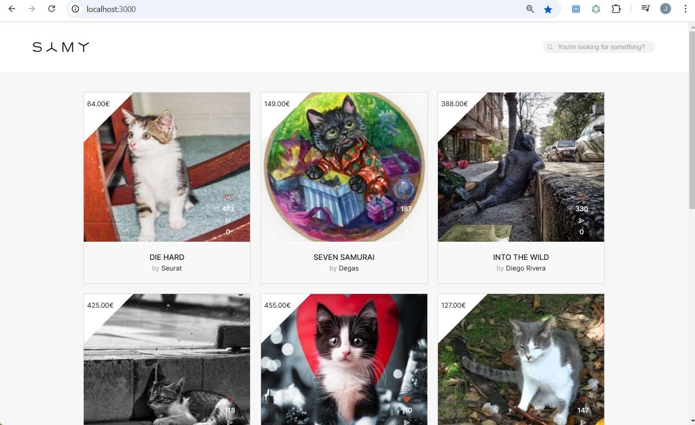

## SAMY ALLIANCE FRONTEND TEST

Necesitamos desarrollar una Single Page Application (SPA) que muestre la información de
nuestras imágenes:

- Mostrar todas las imágenes con un scroll infinito.
- Filtrar el contenido a través de una búsqueda (No es necesario que el resultado sea coherente).
- Realizar un like/unlike de cada uno de los ítems. UI responsive.

Información:

La api se encuentra disponible en https://sandbox-api-test.samyroad.com/graphql. Es una api
graphql.
Se puede revisar la documentación de la api mediante un cliente graphql como puede ser Altair.
En dicha API se encuentra la colección "images" con los datos de cada imagen. Dicha
colección permite la paginación y el filtrado mediante el parámetro "title".
Además está disponible una mutación para realizar el like/dislike de una imagen.
Se recomienda usar localhost:3000 como url de desarrollo para evitar problemas de Cors.

Diseño:

La aplicación debe ser accesible y responsive, adaptándose correctamente a todos los posibles
tamaños de pantalla.

Los diseños se pueden encontrar en:
https://www.figma.com/design/wKzYmPZ7ww9JCn6wGJ8ZUZ/Frontend-Test?m=auto&t=AVGBt7kVTNvzU1dL-6

Implementación:

- Crear una Single Page Application usando React.
- HTML y estilos responsive a partir de los diseños.

Se valorará el uso e implementación de tests.

Email: [Jorge Segura Martínez](mailto:jorsema2@gmail.com)

## Solución Propuesta

- Dividí la interfaz de usuario en pequeños componentes reutilizables y definí la estructura de los componentes de una manera sencilla para poder testear y ampliar la interfaz de usuario en el futuro.
- Diseñé la arquitectura de estado utilizando useState y Apollo GraphQL. Dada la simplicidad del estado de la aplicación y el uso de GraphQL, no era necesaria una herramienta de gestión de estado global como Redux. Si la aplicación creciese, podría ser necesario usar una herramienta de gestión de estado global.
- Creé componentes y llamadas a la API para mostrar productos/imágenes y sus detalles.
- Implementé un infinite scroll utilizando ApolloGraphQL, la Intersection Observer API y useRef.
- Añadí la feature para dar like/unlike a un producto.
- Usé Cypress para crear dos tests que comprueban que los productos se cargan correctamente y que la búsqueda funciona bien.
- Usé React testing library y Jest para testear algunos aspectos del componente Product.
- Maqueté con CSS de forma que la app sea responsive traduciendo los diseños de Figma.
- Hice que la aplicación fuera accesible utilizando elementos HTML semánticos, el atributo alt, etc.

## Screenshots

## Librerías/herramientas usadas

- React.js.
- Vite para el setup del proyecto.
- Cypress.
- React testing library.
- Jest.
- API: https://sandbox-api-test.samyroad.com/graphql

## Setup

Para instalar las dependencias:

`npm install`

Para ejecutar la aplicación (se abrirá en el puerto 3000):

`npm run dev`

## Ejecutar los tests

Los tests unitarios se pueden ejecutar con `npm run test`.

Para lanzar los tests de Cypress, será necesario ejecutar la app primero usando `npm run dev` y comprobar que está ejecutándose en [http://127.0.0.1:3000/]([http://127.0.0.1:3000/]).

Una vez la app se esté ejecutándo con `npm run dev`, se pueden ejecutar los tests de Cypress usando:

1. `npx cypress open`.
2. Clicar en "E2E Testing".
3. Escoger un navegador.
4. Clicar en el archivo `ProductsPage.cy.js` y los tests deberían ejecutarse automáticamente.

## Posible Trabajo Futuro

1. Añadir una feature para compartir productos (si la API lo permitiese).
2. Añadir más tests unitarios y end to end.
3. Refinar el CSS en algunas áreas (e.g. botones like y enviar se mueven al clicar el botón de like).
4. Añadir skeletons para los productos.
5. Si la gestión de estado se vuelve más compleja, añadir una herramienta como Redux.
